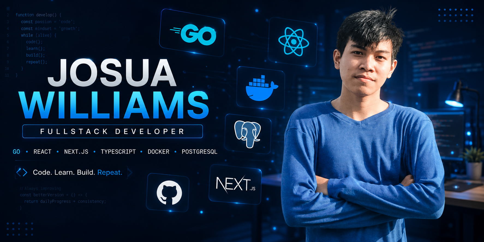

### Software Engineer from Indonesia 🇮🇩

Building modern web applications with clean UI, scalable backend, and maintainable code.

---

## 👨‍💻 About Me

- 💻 Focused on **Frontend Engineering**, **Backend Development**, and **Clean Architecture**
- 🚀 Currently learning **Golang**, **Docker**, **Laravel**, **Spring Boot**, and **System Design**
- ⚛️ Working with **React**, **Next.js**, **Node.js**, and **Express.js**
- 🗄️ Experienced with **MySQL**, **PostgreSQL**, and **MongoDB**
- 📱 Exploring **React Native**, **Flutter**, and mobile app development
- ⚡ Motto: **Code. Learn. Build. Repeat.**

---

## 🚀 Tech Stack

### ⚛️ Frontend

  

### 🔥 Backend

  

### 🗄️ Database

  

### ⚙️ DevOps & Tools

  

### 📱 Mobile

  

---

## 📊 GitHub Analytics

 

---

## 📈 Contribution Graph

---

## 🐍 Contribution Snake

---

## 💻 Favorite Technologies

  
  
  
  
  
  
  
  

---

## 🌐 Connect With Me

---

